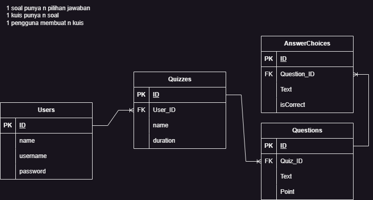

# Quizin 📑
A simple API implementing CRUD, authentication, and authorization for quiz application

## Stack 🧰

 

## Features 🌟
- See who's on top of every quiz you have
- See how well you're doing in the quiz you've done by seeing your stats, show them who's the boss!
- Make quiz that is either private or public, it's up to you!
- Make private rooms to access your private quizzes
- Manage who could access your private rooms
- Register and log in to your account!
  
## Schema 🗺

## Endpoints
List of endpoints of this API
### `/auth`
- `/login`: Log in to your registered account
  - POST
      - Requires: ~
      - Role: Any
- `/register`: Create an account to use
  - POST
      - Requires: ~
      - Role: Any

### `/app`
- `/profile` - See your own profile
  - GET
      - Requires: Valid JWT Token
      - Role: Any
- `/dashboard` - See your the statistics of the quizzes you've done
  - GET
      - Requires: Valid JWT Token
      - Role: Any
- `/leaderboard/:quizId`
  - GET
      - Requires: ~
      - Role: Any

### `/user`
- `/` - Get all data from `Users`
  - GET
      - Requires: Valid JWT Token
      - Role: Superadmin
- `/:userId` - Do something on `Users` with id `userId`
  - GET
      - Requires: Valid JWT Token which has `id` data that matches `userId`
      - Role: Any
  - POST
      - Requires: Valid JWT Token which has `id` data that matches `userId`
      - Role: Superadmin
  - PUT
      - Requires: Valid JWT Token which has `id` data that matches `userId`
      - Role: Any
  - DELETE
      - Requires: Valid JWT Token which has `id` data that matches `userId`
      - Role: Superadmin

